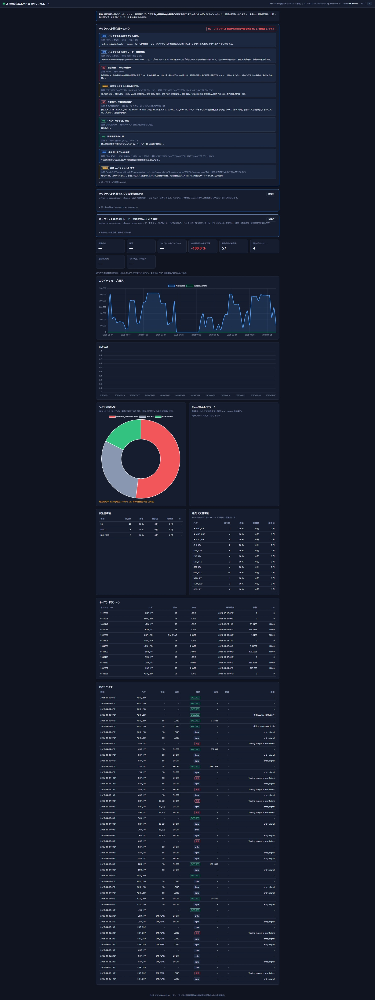
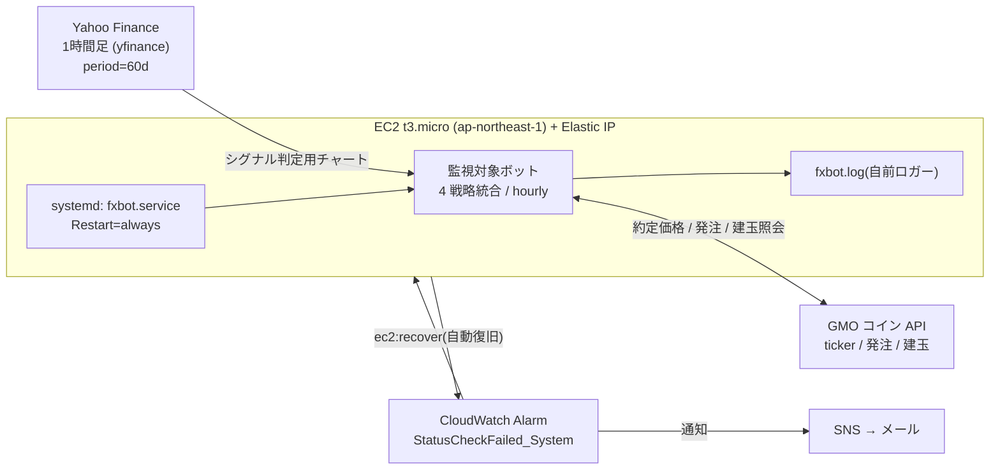
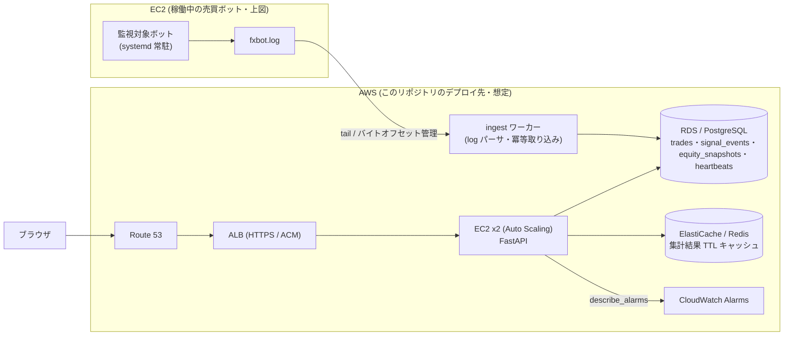
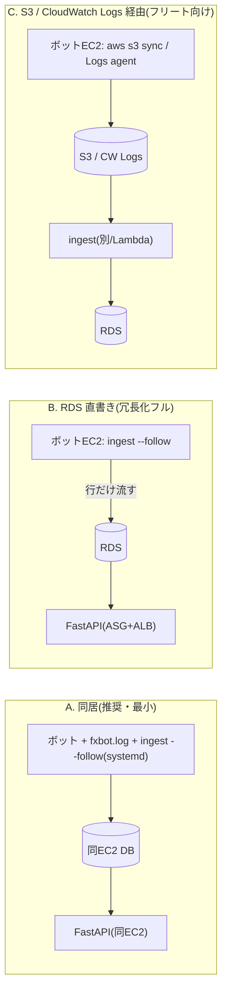

# 通貨自動売買ボット バックテスト整合性ダッシュボード

> **公開ポートフォリオです。** 戦略パラメータ・バックテスト実績値は
> `app/baseline.py` / `backtest/strategies.py` / `backtest/exits.py` とも
> **一般的なサンプル値に置き換えてあり**、実際に運用しているボットの値ではありません。
> このリポジトリで見せたいのは、実運用で困った経験と、それを検知するために作っている監視ツールです。
> 実務経験として説明できるのはボットの運用・障害対応まで。監視ツールのアプリと、
> AWS の冗長化・ヘルスチェック設計・IaC は、実務で必要になる範囲を学びながら組んでいる段階です。

## 目的

通貨の自動売買で、**4 戦略統合のボット(別管理)を EC2 上で数ヶ月以上稼働** させている。
その運用で、**資産推移だけを見ていては気づけない乖離**を事後で発見した:

- シグナルの過半数が証拠金不足で**失注**していた(バックテストは全シグナル約定前提)
- ボットプロセスが**二重起動**して実質 2 倍のリスクを取っていた
- コード上の `max_positions` 上限が「上限なし」という方針と**食い違って**いた
- 実運用の手法別シグナル比率がバックテストの分布から**ドリフト**していた(一部手法が過少)

このダッシュボードの中心機能は資産推移の可視化ではなく、
**「実運用がバックテスト(`app/baseline.py`)の前提どおりに取引できているか」を機械的に突き合わせ、
乖離を OK / 要確認 / NG で提示する整合性チェック**(`app/reconciliation.py`)。

> 主眼は「運用(数ヶ月の稼働・乖離検知・障害対応)」。
> AWS の冗長化・ヘルスチェック設計・IaC は、実務で必要になる設計を知るために
> 検討・ドキュメント化した段階で、実際には未構築・単一構成で運用している(→ アーキテクチャの節)。

## バックテスト整合性チェック(中心機能)

| チェック | 判定基準 | 何を疑うか |
|---|---|---|
| **バックテスト再現 ①シグナル単位(entry)** | 一致率 < 90% で要確認 / < 75% で NG | バックテスト戦略の entry シグナルと実運用シグナルを 1 件ずつ突合(MATCHED / MISSING / EXTRA / MISMATCH)。詳細は [`docs/PARITY.md`](docs/PARITY.md) |
| **バックテスト再現 ②トレード・損益単位** | 勝敗一致率(マッチ分)< 80% で要確認 / < 60% で NG | エグジット(SL/TP/トレール)を再現した「バックテストなら成立したトレード」と実 trades を突合。カバレッジ(取れた割合)・勝敗一致・平均R・決済理由を比較 |
| 取引機会 → 約定の実行率 | < 90% で要確認 / < 50% で NG | バックテストは全機会で約定前提。連続する同一(ペア×手法)の発注試行は 1 機会に畳んで数える |
| 手法別シグナル比率のドリフト | 期待比率(バックテスト件数ベース)から ±15pt 超で要確認 | 特定手法のシグナルが出ていない/出すぎ = ロジック乖離 |
| 二重発注 / 二重稼働の疑い | 同一サイクル・同一(ペア×手法)の EXECUTED が 2 件以上で NG | プロセス二重起動(実質 2 倍リスク) |
| 1 ペア 1 ポジション制約 | 同一ペアで建玉期間の重なりがあれば NG | バックテスト前提(1 ペア 1 ポジション)からの逸脱 |
| 同時建玉数の上限 | コードの `max_positions` に到達で要確認 | 「現在ポジション」ログの実測値で判定。方針「上限なし」との食い違い |
| 手法別リスク%(中央値) | 桁が明らかにおかしいものだけ要確認 | 実効リスク% = risk円 / 有効証拠金。証拠金変動で試行ごとにブレる |
| 成績 vs バックテスト | 判定せず並記(運用日数・有効証拠金の最小/最大を明示) | サンプルが溜まったら比較 |

---

## 実運用 3 ヶ月のログ(41,697 行)を取り込んで判明したこと

`python -m ingest.ingest --path fxbot.log` で実ログを流すと `data_mode` が `live` になり、
以下が実データで表示される(数値は実際の運用ログから):

| チェック | 実データの結果 |
|---|---|
| **取引機会 → 約定の実行率** | **41%**(167 機会中 69 約定 / 59 証拠金不足で見送り / 39 その他失敗)。バックテストは全機会約定前提なので大きな乖離 |
| **手法別シグナル比率のドリフト** | SB 60% / MACD **7%** / DM_PSAR 32% / BB_SQ 1%。期待比では **MACD が −23pt**(ほぼ発火していない)・DM_PSAR が +18pt |
| **二重発注 / 二重稼働** | 「複数positionId検出」8 件。さらに 2026-09 時点でログ行が二重出力されており、二重稼働が再発している疑い |
| **同時建玉数** | 最大 5(コードの上限 6 未満)。方針の懸念どおりだが、この期間は上限に達していない |
| **有効証拠金** | 3 ヶ月で 0 円に **224 回**到達(その後入金で復帰)。監視対象ボットは 2 度ほぼ全損している |

> ⚠️ ログには**決済価格・損益が残らない**(GMO 側の OCO で決済されるため)。
> このため損益・勝率・エクイティカーブは実データでは埋まらず、KPI タイルは「—」表示になる。
> 損益まで見るには GMO の約定履歴を別ローダで取り込む必要がある(→ `docs/PARITY.md`)。

---

## スクリーンショット



実運用ログ(`python -m ingest.ingest --path fxbot.log`)を取り込んだ画面。整合性チェックが実データで動く。
誰でも同じ画面を試すには `python -m scripts.seed_demo_data`(合成データ・画面上部に「デモ」バナー)。
Chart.js は同梱(`app/static/chart.umd.min.js`)なのでオフラインでもグラフが出る。
KPI などの数値は**合成データ**で、画面上部に「デモデータ表示中」バナーが出る
(実ログを `python -m ingest.ingest` で取り込むとバナーは消え `data_mode=live` になる)。

## ドキュメント

| ファイル | 内容 |
|---|---|
| [`docs/ARCHITECTURE.md`](docs/ARCHITECTURE.md) | 技術背景・設計判断(なぜログ起点か / なぜ Redis は任意依存か / なぜ `/healthz` と `/readyz` を分けるか 等)+ 面接想定 Q&A |
| [`docs/PARITY.md`](docs/PARITY.md) | バックテスト再現(トレード単位照合)の仕組み・使い方・限界(参照実装であること / 価格フィード一致の必要性)|
| [`docs/architecture.drawio`](docs/architecture.drawio) | 構成図の原本(draw.io、3 ページ: As-Is / To-Be / ログ取り込みトポロジ) |
| [`docs/architecture.html`](docs/architecture.html) | 上記をブラウザで見られる mermaid レンダリング版(draw.io 不要) |

---

## その他に可視化するもの

| セクション | 内容 | 運用上の意図 |
|---|---|---|
| ボット死活バッジ | 最終メインチェックからの経過時間で healthy / stale / down を判定 | hourly 実行のボットが黙って止まっていないか |
| KPI | 累積損益・勝率・PF・最大DD・期待値 | 整合性チェックの結果を数値の背景として確認 |
| エクイティカーブ / 日次損益 | 有効証拠金の推移と実現損益 | ドローダウン局面の把握 |
| **シグナル実行率** | 発注できた件数 vs 証拠金不足で失注した件数 | **実運用で失注が過半数だった課題を常時可視化** |
| 手法別成績 | SB / MACD / DM_PSAR / BB_SQ 別の勝率・期待値 | 優先順位(SB→MACD→DM×PSAR→BB-SQ)通りに機能しているか |
| 通貨ペア別成績 | ペア別損益。★=バックテストで BE マイナス寄りの要監視ペア(AUD/JPY・AUD/USD・CAD/JPY) | 監視対象ペアの実績確認 |
| CloudWatch アラーム | 監視ボット EC2 の System Status Check(→ ec2:recover 自動復旧)の状態 | 物理ホスト障害を検知できているか |
| オープンポジション / 直近イベント | 建玉一覧・シグナル/約定/決済の生ログ | 個別の挙動確認 |

---

## アーキテクチャ

### 現行構成(As-Is / 監視対象そのもの)

このダッシュボードが監視する、実際に数ヶ月以上稼働しているボットの構成。



- **シグナル判定は Yahoo Finance の1時間足**(`yf.download(interval='1h', period='60d')`)。
  約定価格・発注・建玉照会だけ GMO API。バックテストは HistData.com(`fx_cache/`)で、
  この **3 フィードの違い**が parity 照合の残差要因になる(→ [`docs/PARITY.md`](docs/PARITY.md))。
- **単一構成(冗長化なし)は意図的**。1 台落ちても損失は「最悪 1 サイクル(1 時間)のシグナル欠損」に留まり、
  Elastic IP + systemd + CloudWatch 自動復旧で数分〜十数分で復帰できるため、ALB / 多重化のコストは見合わないと判断。
- 2026-08 に物理ホスト障害で SSH 不通 → AWS CLI から `stop`→`start` でホスト移設して復旧。
  再発防止に `StatusCheckFailed_System` → `ec2:recover` の CloudWatch アラームと systemd 化を追加した。

### ダッシュボード導入後(To-Be / このリポジトリ)



- **ログ起点**: ボット本体(`監視対象ボット`)には手を入れず、既存の `fxbot.log` を唯一の入力にする。
  売買ロジックと監視を疎結合にして、監視側の不具合が売買を止めないようにするため。
- **集計は pandas / キャッシュは任意**: DB 方言に依存しないよう集計は SQL ではなく pandas で行い、
  結果を Redis に TTL 60 秒でキャッシュする。**Redis は必須依存にせず**、未設定・接続失敗時は
  プロセス内メモリに透過フォールバックする(ダッシュボード上に現在の backend を表示)。
- **ヘルスチェック分離**: `/healthz`(プロセス生存)と `/readyz`(DB 到達性)を分け、
  ALB / ECS のヘルスチェックは `/healthz` を使う。

### 冗長化構成(ALB / Auto Scaling / RDS / ElastiCache)は未構築の検討メモ

実務で必要になるクラウド設計を知るために、上の To-Be 図を調べて描いた段階。
**実際には構築しておらず、ボットは単一構成で運用している**。
個人ボット 1 台の監視にこの構成は過剰なので、実運用でも単一構成が妥当という整理。

---

## ローカルでの動かし方

### A. ゼロ設定(SQLite + プロセス内キャッシュ)

```bash
python -m venv .venv && . .venv/Scripts/activate   # Windows
pip install -r requirements.txt

python -m scripts.seed_demo_data      # 約120日ぶんのデモデータを生成
uvicorn app.main:app --reload         # http://localhost:8000
```

### B. 本番相当(PostgreSQL + Redis、Docker)

```bash
cp .env.example .env
docker compose up --build             # db(Postgres) / redis / web(seed 実行後に起動)
# http://localhost:8000
```

### 実ログの取り込み

```bash
# 1 回だけ
python -m ingest.ingest --path /path/to/fxbot.log

# 追記を監視し続ける(30 秒間隔)
python -m ingest.ingest --path /path/to/fxbot.log --follow
```

バイトオフセットを `.ingest_state.json` に記録するため、繰り返し実行しても重複取り込みしない。
取り込みに成功すると `data_mode` が `demo` → `live` になり、デモバナーが消える。

#### 本番でのログ取り込みトポロジ

手動 SCP は「ローカル初回に parser の正規表現が実ログ書式と合うか確認する」ためだけ。本番は次のいずれか
(draw.io の 3 ページ目 `docs/architecture.drawio` に図あり):



- **A**: ダッシュボードをボット EC2 に同居させると `fxbot.log` はただのローカルファイル。転送ゼロ
- **B**: `ingest --follow` をボット EC2 で回し `DATABASE_URL` を RDS に向ける。ログは EC2 から出ず、構造化行だけが DB 接続で流れる(To-Be 図がこれ)
- **C**: `ingest` に S3 / CloudWatch Logs 読み込みの小改修が必要

### バックテスト再現(①シグナル + ②トレード・損益)

```bash
# ★推奨: 本番ボットと同じ Yahoo Finance の 1時間足で照合(--mode both が既定)
python -m backtest.replay --yfinance --start 2026-07-10 --end 2026-09-07

# 参考: HistData の 1時間足 / 同梱スライス / 合成デモ
python -m backtest.replay --fx-cache ../fx_cache --start 2026-03-01 --end 2026-06-05
python -m backtest.replay --ohlc backtest/sample_ohlc.csv
python -m backtest.replay --demo
```

結果は `parity_runs`(`mode='signal'` / `'trade'`)に保存され、ダッシュボードの
「バックテスト再現 ①シグナル単位 / ②トレード・損益単位」パネルに出る。
**注意**: シグナル判定は Yahoo Finance、`fx_cache` は HistData、約定は GMO の 3 フィード。
`--yfinance` 以外はフィード差ぶんのノイズが乗る。仕組み・限界は [`docs/PARITY.md`](docs/PARITY.md)。

### テスト

```bash
pip install -r requirements-dev.txt
pytest
```

- `tests/test_parser.py` … ログ 1 行 → 構造化イベントの変換
- `tests/test_aggregations.py` … 勝率 / PF / 実行率 / 要監視ペア判定の集計ロジック
- `tests/test_reconciliation.py` … 整合性チェック(実行率 NG / 二重発注検出 / 1 ペア 1 ポジション違反 / max_positions 到達 / シグナル比率ドリフト)
- `tests/test_backtest_replay.py` … シグナル分類・時刻許容・OHLC ローダ・yfinance シンボルマップ・エグジット再現・トレード差分・parity_runs(signal/trade)書き込み

---

## 想定 AWS デプロイ構成(未構築)

| 層 | サービス | 備考 |
|---|---|---|
| DNS / 証明書 | Route 53 + ACM | 独自ドメイン + HTTPS |
| ロードバランサ | ALB | ヘルスチェックパス `/healthz` |
| アプリ | EC2 x2 + Auto Scaling(または ECS Fargate) | `uvicorn app.main:app` |
| DB | RDS for PostgreSQL | `DATABASE_URL` で接続 |
| キャッシュ | ElastiCache for Redis | `REDIS_URL` で接続。無くても動作 |
| 監視 | CloudWatch Alarms | 売買ボット EC2 の `StatusCheckFailed_System` → `ec2:recover` |
| 取り込み | 同一 EC2 の systemd タイマー / EventBridge Scheduler | `ingest.ingest --follow` |

IaC(Terraform / CloudFormation)は次段階。現状はアプリ層のみ。

---

## このダッシュボードが必要になった経緯

- **2026-08**: EC2 の物理ホスト障害で SSH 不通。AWS CLI 側から `stop`→`start` でホスト移設して復旧。
  再発防止に CloudWatch アラーム(`StatusCheckFailed_System` → `ec2:recover`)と systemd 化を実施。
  → *ダッシュボードの CloudWatch パネル・死活バッジはこの経験から。*
- **2026-09**: 3 ヶ月ぶんのログを分析し、
  ① シグナルの過半数が「Trading margin is insufficient」で失注、
  ② ボットプロセスが二重起動して実質 2 倍のリスクを取っていた、を発見。
  → *シグナル実行率パネル・オープンポジション/建玉数パネルはこの発見から。*

「メール通知は来ていたが気づかなかった」ため、**能動的に見にいける 1 画面** を用意することが狙い。

---

## ディレクトリ構成

```
fxbot_dashboard/
├── app/
│   ├── config.py          # 環境変数ベース設定(pydantic-settings)
│   ├── db.py              # SQLAlchemy エンジン / セッション
│   ├── models.py          # 4 テーブル定義
│   ├── cache.py           # Redis / プロセス内メモリの透過フォールバック
│   ├── cloudwatch.py      # boto3 describe_alarms(認証なしでも落とさない)
│   ├── baseline.py        # バックテストの前提(risk% / 優先順位 / 期待シグナル比率 / max_positions 等)
│   ├── reconciliation.py  # ★中心機能: 実運用 vs baseline の整合性チェック(8項目)
│   ├── aggregations.py    # pandas 集計(DB 方言非依存・テスト対象)
│   ├── main.py            # FastAPI ルーティング + ヘルスチェック
│   ├── templates/index.html
│   └── static/            # dashboard.js(Chart.js CDN)・style.css
├── backtest/              # ★バックテスト再現(シグナル + トレード・損益)
│   ├── indicators.py      # EMA / MACD / Bollinger / ATR / PSAR(ベクトル化)
│   ├── strategies.py      # 4手法の entry シグナル生成(仕様からの参照実装 → PARITY.md)
│   ├── exits.py           # SL/TP/トレールのエグジット再現(近似)→ SimTrade
│   ├── ohlc.py            # OHLC ローダ(標準 / HistData / yfinance)+ デモ生成
│   ├── replay.py          # run()=シグナル照合 / run_trades()=トレード・損益照合 → parity_runs
│   └── sample_ohlc.csv    # 小さなスライス(HistData.com/fx_cache 由来、3ペア×約1ヶ月)
├── ingest/
│   ├── parser.py          # ログ 1 行 → LogEvent(純粋関数)
│   ├── ingest.py          # オフセット管理付き取り込み + trades 導出
│   └── sample_fxbot.log
├── scripts/seed_demo_data.py
├── tests/
├── docker-compose.yml / Dockerfile
└── .env.example
```

## 今後の課題

- IaC 化(Terraform)と CI(pytest + ruff)
- 取り込みの EventBridge / systemd タイマー化
- しきい値超過時の Slack 通知(現状は画面表示のみ)
- 実ログ書式の確定(`parser.py` の正規表現は想定書式ベース。実ファイルに合わせて要調整)
